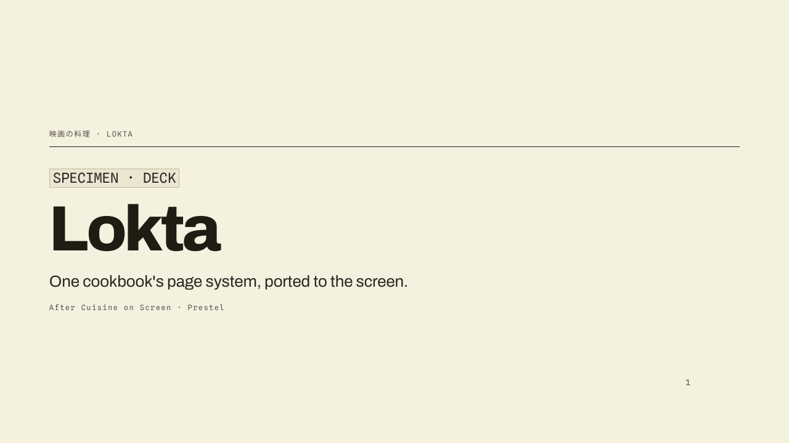
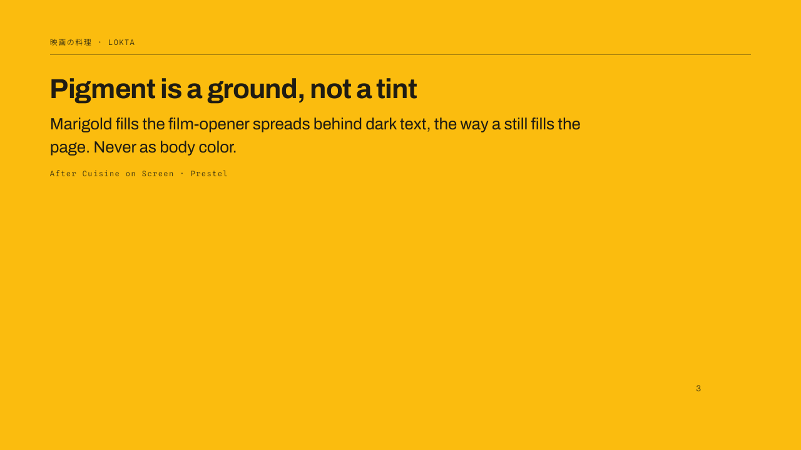
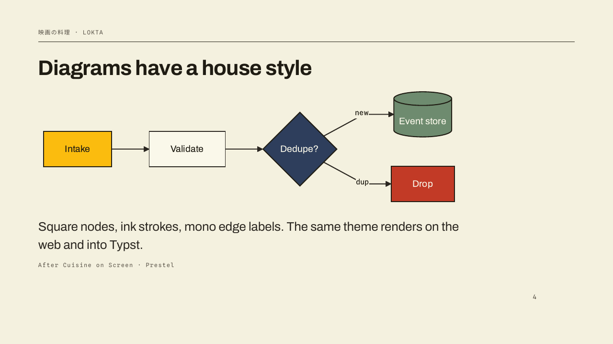
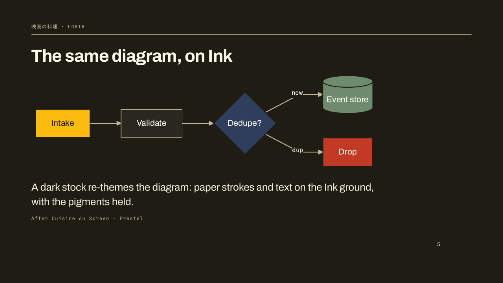
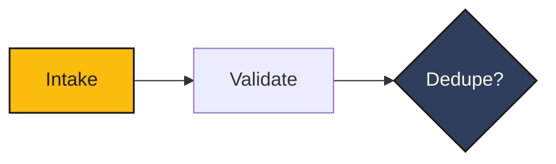

# lokta-marp

A [Marp](https://marp.app) theme from the [Lokta](https://github.com/msradam/lokta)
design system. Editorial slides: a warm cream stock, hard rules, hatched
end-marks, tracked mono labels, and pigment grounds. Fonts are self-hosted and
embedded at render time (no Google Fonts CDN), and ```mermaid``` blocks pick up
the Lokta diagram theme, re-themed per slide for light and Ink grounds.









## Preview

[examples/deck.pdf](examples/deck.pdf), the full example deck (light, marigold, and Ink slides, with diagrams).

## Quick start

A fresh deck folder with full theme support in three steps.

**1. Install in a new folder:**

```bash
mkdir pitch-deck && cd pitch-deck
npm init -y
npm install github:msradam/lokta-marp @marp-team/marp-cli mermaid
```

**2. Drop in `.marprc.js`:**

```js
const path = require('path');
const engine = require.resolve('lokta-marp');
const root = path.dirname(path.dirname(engine));
module.exports = {
  engine,
  themeSet: [path.join(root, 'themes')],
  html: true,
  allowLocalFiles: true,
};
```

**3. Write `deck.md`:**

````markdown
---
marp: true
theme: lokta
paginate: true
---

# Hello

---

<!-- _class: invert -->

## Dark slide
````

Render:

```bash
npx marp --config .marprc.js deck.md -o deck.pdf
# or -o deck.html / deck.pptx
```

The engine embeds the self-hosted fonts into the output, so a rendered deck
carries Archivo, Spline Sans Mono, Source Serif, and the Japanese face with no
network and no Google Fonts CDN.

## Light install (theme only)

If you do not want a `node_modules/` folder in your deck directory, save just the
CSS to a central location:

```bash
mkdir -p ~/.marp/themes
curl -sL https://raw.githubusercontent.com/msradam/lokta-marp/main/themes/lokta.css -o ~/.marp/themes/lokta.css
marp --theme ~/.marp/themes/lokta.css deck.md -o deck.pdf
```

Fonts then fall back to the system (the engine is what embeds them), and Mermaid
blocks are not auto-themed. For the full experience, use the Quick start above.

### VS Code live preview

Install [Marp for VS Code](https://marketplace.visualstudio.com/items?itemName=marp-team.marp-vscode),
open your user settings JSON, and add:

```json
{
  "markdown.marp.themes": ["/Users/YOU/.marp/themes/lokta.css"]
}
```

Any `.md` with `marp: true` and `theme: lokta` now previews with the theme. The
extension uses its own engine, so it will not run the per-slide Mermaid theming
or font embedding; use the Quick start CLI for final exports.

## Per-slide variants

Apply with `<!-- _class: NAME -->` on one slide, or `class:` in front matter for
the whole deck. Classes can combine (e.g. `lead invert`).

**Stocks** re-point the whole slide. Paper is the default.

| Class | Stock |
| --- | --- |
| (none) | Paper, the warm cream default |
| `invert` or `ink` | Ink, the warm dark stock |
| `bone` | Bone, the cool light stock |
| `indigo` | Indigo, the cool dark stock |

**Grounds** are full-bleed feature slides in one pigment, with AA-safe text.

| Class | Ground | Text |
| --- | --- | --- |
| `marigold` | the hero pigment | dark |
| `peach` | heritage salmon | dark |
| `lavender` | the cover tone | dark |
| `aubergine` | feature panel | light |
| `cinnabar` | the danger pigment | light |
| `celadon` | the success pigment | light |
| `night` | dramatic opener | light |

**Layout**: `lead` is the cover slide (oversized Archivo h1).

Inline: a backtick `` `LABEL` `` on its own line renders a tracked eyebrow, `---`
becomes the hatched end-mark, and `>` blockquotes set in Source Serif.

## Customizing

Every font and colour is a CSS variable. Override them with the `style:`
directive, per deck or per slide.

```yaml
---
marp: true
theme: lokta
style: |
  section {
    --display: 'Inter', sans-serif;   /* swap the display/body face   */
    --mono: 'JetBrains Mono', monospace;
    --serif: 'Newsreader', serif;
    --marigold: #FFD23F;              /* retune the hero pigment       */
    --paper-01: #F7F4E9;             /* warm the page surface          */
  }
---
```

Font dials: `--display`, `--mono`, `--serif`. Colour dials: `--paper-00..04`,
`--ink-40..100`, and `--marigold`, `--peach`, `--lavender`, `--aubergine`,
`--cinnabar`, `--celadon`, `--indigo`, `--night`.

## Mermaid

Write a ```mermaid``` fence and the engine renders it with the Lokta diagram
theme, re-themed from the slide's class (light by default, the dark palette on
dark grounds like `invert`, `indigo`, and `night`).

````markdown

````

Live fences render in HTML decks. PDF and PPTX export rasterizes runtime diagrams
unreliably, so for print the example deck embeds pre-rendered SVGs instead:

```bash
mmdc -c lokta-mermaid.json -C lokta-mermaid.print.css -i diagram.mmd -o diagram.svg
```

```markdown

```

See [lokta-mermaid](https://github.com/msradam/lokta-mermaid) for the diagram
theme and the node classes (`hero`, `store`, `dec`, `danger`, `muted`).

## Fonts

Self-hosted (SIL OFL): Archivo, Spline Sans Mono, Source Serif 4, Noto Sans JP.
The engine reads them from `themes/fonts/` and embeds them as base64 at render,
so the theme does not hot-link the Google Fonts CDN (a GDPR exposure in the EU).

## Files

```
engine/index.js    custom Marp engine: Mermaid fences, per-slide theming, font embedding
mermaid/index.js   Lokta Mermaid palettes (light and Ink) and node classes
themes/lokta.css   the theme, with the Mermaid CSS rules
themes/fonts/      self-hosted woff2 the engine embeds
examples/deck.md   demo deck source (+ rendered deck.html, deck.pdf)
.marprc.js         config wiring the engine and theme
```

## License

MIT. Fonts are SIL OFL. Part of the [Lokta](https://github.com/msradam/lokta)
design system, drawn from the cookbook *Cuisine on Screen* (Sachiyo Harada,
Prestel) and Professor Siddika Kabir's *Ranna Khaddo Pushti*.
