<!-- _class: lead -->

`SPECIMEN · DECK`

# Lokta

One cookbook's page system, ported to the screen.

---

## Three voices

The system keeps a neutral grotesk, a paper-friendly mono, and an editorial serif.

- **Archivo** carries display and body
- **Spline Sans Mono** sets labels, folios, and figures
- *Source Serif* handles pull quotes

---

<!-- _class: marigold -->

## Pigment is a ground, not a tint

Marigold fills the film-opener spreads behind dark text, the way a still fills the page. Never as body color.

---

## Diagrams have a house style

Square nodes, ink strokes, mono edge labels. The same theme renders on the web and into Typst.

---

<!-- _class: invert -->

## The same diagram, on Ink

A dark stock re-themes the diagram: paper strokes and text on the Ink ground, with the pigments held.

---

<!-- _class: lead -->

# Thank you

`LOKTA · v0.1 · MMXXVI`
